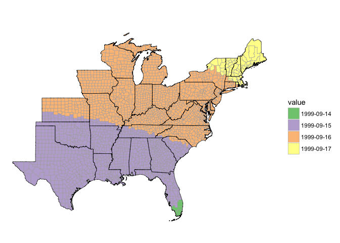
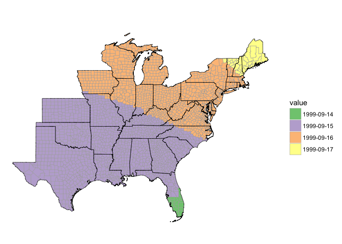

<!-- README.md is generated from README.Rmd. Please edit that file -->
Aims of the package
-------------------

This package allows you to convert time from Coordinated Universal Time (UTC, also known as Zulu Time) to local time for US counties based on each county's FIPs code. You can use this to convert time zones in either a dataframe with all values from one county or a dataframe with values from many different time zones.

Many observational datasets express date-times using UTC, to ensure consistency across time zones. Examples include datasets for satellite-based and / or hourly data and aviation data \[Morris Weatherwise article\]. Other data is collected and aggregated based on local time (e.g., daily counts of health outcomes for a community). Thus, it is often helpful to be able to convert date-time values for observations from UTC to local time. This package allows you to make that conversion for any dataset where each observation can be associated with a US county Federal Information Processing Standard (FIPS) code.

These local time conversions take into account whether or not the county was observing Daylight Savings Time at the time of the observation. This package can be used both with datasets where all observations are from the same county and for datasets where observations are associated with a number of different counties.

Accessing the package
---------------------

This package is currently under development on GitHub. It can be installed using the `devtools` package:

``` r
library(devtools)
install_github("geanders/countytimezones")
library(countytimezones)
```

Simple example
--------------

As a simple example, if you want to convert 8:30 UTC on Jan. 1, 1999 to local time in counties throughout the US, you could run:

``` r
data(county_tzs)
example_df <- data.frame(fips = county_tzs$fips,
                 datetime = "1999-01-01 08:30")
head(example_df)
#>   fips         datetime
#> 1 1001 1999-01-01 08:30
#> 2 1003 1999-01-01 08:30
#> 3 1005 1999-01-01 08:30
#> 4 1007 1999-01-01 08:30
#> 5 1009 1999-01-01 08:30
#> 6 1011 1999-01-01 08:30

example_df <- add_local_time(df = example_df,
                             fips = example_df$fips,
                             datetime_colname = "datetime")
head(example_df)
#>   fips         datetime       local_time local_date        local_tz
#> 1 1001 1999-01-01 08:30 1999-01-01 02:30 1999-01-01 America/Chicago
#> 2 1003 1999-01-01 08:30 1999-01-01 02:30 1999-01-01 America/Chicago
#> 3 1005 1999-01-01 08:30 1999-01-01 02:30 1999-01-01 America/Chicago
#> 4 1007 1999-01-01 08:30 1999-01-01 02:30 1999-01-01 America/Chicago
#> 5 1009 1999-01-01 08:30 1999-01-01 02:30 1999-01-01 America/Chicago
#> 6 1011 1999-01-01 08:30 1999-01-01 02:30 1999-01-01 America/Chicago
```

You can use functions from the `choroplethr` package to map the local values:

``` r
library(choroplethr)
library(ggplot2)
library(dplyr)

to_plot <- example_df %>%
  select(fips, local_time) %>%
  mutate(local_time = factor(local_time)) %>%
  dplyr::rename(region = fips, value = local_time)
a <- CountyChoropleth$new(to_plot)
a$ggplot_scale <- scale_fill_brewer(type = "qual", drop = FALSE)
a$render()
```


Here is the same map for a date-time during the summer, when many counties use Daylight Savings Time:

``` r
example_df2 <- data.frame(fips = county_tzs$fips,
                 datetime = "1999-07-01 08:30") 
example_df2 <- add_local_time(example_df2, fips = example_df2$fips,
                              datetime_colname = "datetime")

to_plot <- example_df2 %>%
  select(fips, local_time) %>%
  mutate(local_time = factor(local_time)) %>%
  dplyr::rename(region = fips, value = local_time)
a <- CountyChoropleth$new(to_plot)
a$ggplot_scale <- scale_fill_brewer(type = "qual", drop = FALSE)
a$render()
```


More complex example
--------------------

As a more complex example, the `closest_dist` data from the `hurricaneexposure` package (which can be installed from "geanders/hurricanceexposure" on GitHub) has data on the date when tropical storms were closest to US counties:

``` r
# install_github("geanders/hurricaneexposure") # if you need to install the package
library(hurricaneexposure)
data(closest_dist)

floyd <- dplyr::filter(closest_dist, storm_id == "Floyd-1999")
head(floyd)
#>     storm_id  fips closest_date storm_dist
#> 1 Floyd-1999 01001 199909151430   729.1446
#> 2 Floyd-1999 01003 199909151200   830.7595
#> 3 Floyd-1999 01005 199909151245   607.1626
#> 4 Floyd-1999 01007 199909151630   796.6668
#> 5 Floyd-1999 01009 199909151800   765.1252
#> 6 Floyd-1999 01011 199909151330   648.6312

floyd <- add_local_time(floyd, fips = floyd$fips,
                        datetime_colname = "closest_date")
head(floyd)
#>     storm_id  fips closest_date storm_dist       local_time local_date
#> 1 Floyd-1999 01001 199909151430   729.1446 1999-09-15 09:30 1999-09-15
#> 2 Floyd-1999 01003 199909151200   830.7595 1999-09-15 07:00 1999-09-15
#> 3 Floyd-1999 01005 199909151245   607.1626 1999-09-15 07:45 1999-09-15
#> 4 Floyd-1999 01007 199909151630   796.6668 1999-09-15 11:30 1999-09-15
#> 5 Floyd-1999 01009 199909151800   765.1252 1999-09-15 13:00 1999-09-15
#> 6 Floyd-1999 01011 199909151330   648.6312 1999-09-15 08:30 1999-09-15
#>          local_tz
#> 1 America/Chicago
#> 2 America/Chicago
#> 3 America/Chicago
#> 4 America/Chicago
#> 5 America/Chicago
#> 6 America/Chicago

eastern_states <- c("alabama", "arkansas", "connecticut", "delaware",
                            "district of columbia", "florida", "georgia", "illinois",
                            "indiana", "iowa", "kansas", "kentucky", "louisiana",
                            "maine", "maryland", "massachusetts", "michigan",
                            "mississippi", "missouri", "new hampshire", "new jersey",
                            "new york", "north carolina", "ohio", "oklahoma",
                            "pennsylvania", "rhode island", "south carolina",
                            "tennessee", "texas", "vermont", "virginia",
                            "west virginia", "wisconsin")

library(lubridate)
to_plot <- select(floyd, fips, closest_date) %>%
  mutate(fips = as.numeric(fips),
         closest_date = ymd_hm(closest_date)) %>%
  mutate(closest_date = format(closest_date, "%Y-%m-%d")) %>%
  dplyr::rename(region = fips, value = closest_date)
a <- CountyChoropleth$new(to_plot)
a$ggplot_scale <- scale_fill_brewer(type = "qual", drop = FALSE)
a$set_zoom(eastern_states)
a$render()
```



``` r

to_plot <- select(floyd, fips, local_date) %>%
  mutate(fips = as.numeric(fips))%>%
  dplyr::rename(region = fips, value = local_date)
a <- CountyChoropleth$new(to_plot)
a$ggplot_scale <- scale_fill_brewer(type = "qual", drop = FALSE)
a$set_zoom(eastern_states)
a$render()
```



``` r
to_plot <- select(floyd, fips, closest_date) %>%
  filter(substring(fips, 1, 2) %in% c("47")) %>%
  mutate(fips = as.numeric(fips), 
         closest_date = ymd_hm(closest_date)) %>%
  mutate(closest_date = format(closest_date, "%Y-%m-%d %H")) %>%
  mutate(closest_date = factor(closest_date)) %>%
  dplyr::rename(region = fips, value = closest_date) %>%
  filter(value %in% levels(value)[2:9]) %>%
  mutate(value = factor(value))

a <- CountyChoropleth$new(to_plot)
a$ggplot_scale <- scale_fill_brewer(type = "qual", drop = FALSE)
a$set_zoom(c("tennessee"))
a$render()
```


``` r

to_plot <- select(floyd, fips, local_time) %>%
  filter(substring(fips, 1, 2) %in% c("47")) %>%
  mutate(fips = as.numeric(fips), 
         local_time = ymd_hm(local_time)) %>%
  mutate(local_time = format(local_time, "%Y-%m-%d %H")) %>%
  mutate(local_time = factor(local_time)) %>%
  dplyr::rename(region = fips, value = local_time) %>%
  filter(value %in% levels(value)[2:9]) %>%
  mutate(value = factor(value))

a <- CountyChoropleth$new(to_plot)
a$ggplot_scale <- scale_fill_brewer(type = "qual", drop = FALSE)
a$set_zoom(c("tennessee"))
a$render()
```


